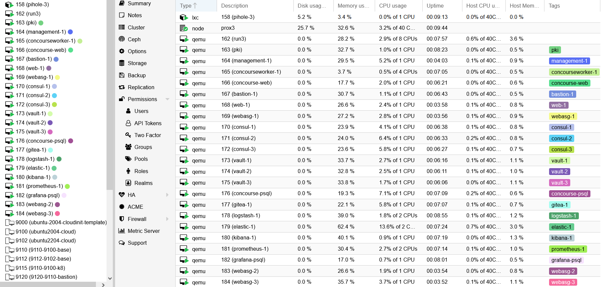

# Vaulter Unsealer TLS

A tool to implement auto-unsealing of HashiCorp Vault nodes that use TLS.

This was derived from: https://github.com/devops-rob/vault-unsealer

The article for the original code: https://www.hashicorp.com/blog/running-vault-on-nomad-part-3

_**NOTE: This is designed as a workflow Proof of Concept. Production use of Vault Unsealer TLS is discouraged at present.**_

## Preamble

I have a homelab running on an old Dell R630 which i turn off when not in use.

In it i have a `run host` called `run3`, in which i run a single instance of nomad to deploy localstack for SQS and minio for S3 to provide services to a mini dev environment (a work in progress):



This repo adds nomad job `vault-unseal-TLS` to `run3`'s nomad to unseal my vault cluster that is using TLS at power up.

The configuration details outlined here are specific to my needs, please adjust them to suite yours.

## Configuration

Vault Unsealer TLS takes a `.json` configuration file with the following configuration parameters:

- `log_level` _(type: string, required: false)_ - This sets the servers log level output. Supported values are `trace`, `debug`, `info`, `warn`, and `err`. The default log level is `info`.
- `probe_interval` _(type: int, required: true)_ - This specifies the frequency of the Vault seal status probe check in seconds.
- `nodes` _(type: []string, required: true)_ - This is a list of Vault server nodes that Vault Unsealer TLS will manage the seal status of.
- `unseal_keys` _(type: []string, required: true)_ - A list of Vault unseal keys that can be used to unseal Vault. The number of keys in this list should be equal to or greater than the unseal threshold required for your Vault cluster.

_*Example Configuration*_

```json
{
  "log_level": "debug",
  "probe_interval": 10,
  "nodes": [
    "https://192.168.1.141:8200",
    "https://192.168.1.142:8200",
    "https://192.168.1.143:8200"
  ],
  "unseal_keys": [
    "aa109356340az6f2916894c2e538f7450412056cea4c45b3dd4ae1f9c840befc1a",
    "4948bcfe36834c8e6861f8144672cb804610967c7afb0588cfd03217b4354a8c35",
    "7b5802f21b19s522444e2723a31cb07d5a3de60fbc37d21f918f998018b6e7ce8b"
  ]
}
```

## TLS

From where `vault-unsealer-TLS` is run, create a directory named `tls` and in it place files as:

```text
/mnt/S3andSQS/tmp/nomad
                  ├── vaultUnsealTLS
                  │   ├── config.json
                  │   ├── tls
                  │   │   ├── ca.crt
                  │   │   ├── server.crt
                  │   │   └── server.key
                  │   └── vault-unsealer-TLS
                  └── vault-unseal-tls.nomad
```

I got the files in directory 'tls' from one of my 3 vault servers: vault-1, /etc/vault/tls

TODO need to check if the files in the tls directory change over the coming months in vault-1 and maybe run this as a service on vault-1 ?

## Usage

### Build binary

Build the binary (ensure static linking for libc) with:

```shell
CGO_ENABLED=0 GOOS=linux go build -ldflags '-extldflags "-static"' -o vault-unsealer-TLS
```

and copy `vault-unsealer-TLS` into:

```text
/mnt/S3andSQS/tmp/nomad/vaultUnsealTLS
```

This location should also have the `tls` directory setup as detailed earlier.

### Nomad

On host `run3` update the file `/etc/nomad.d/nomad.hcl` to have the section `host_volume "vaultUnsealTLS"` as per the copy of my nomad.hcl file in this repo, and reboot `run3`.

On host `run3`, do:

```shell
nomad job plan vault-unseal-tls.nomad 
```

and if the plan is ok, do:

```shell
nomad job run vault-unseal-tls.nomad
```

Confirm all is as expected ... you see the vault cluster being unsealed in the `run3` nomad job `vault-unseal-tls` logs, similar to:


Reboot the whole of the dell server and again check vault is unsealed. If its not investigate syslog files, etc on the VM's.

### Remember

This is NOT for Production use !
